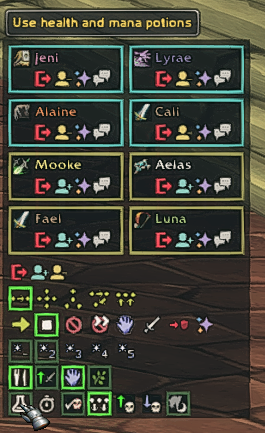

# Mangosbot UI (WoW client addon)
## Installation
Create a folder named Mangosbot in your addOns folder and then drag everything over, alternatively you can simply download the zip from the releases and then extract that to your addons folder as that might be a lot cleaner. This only works for clients running some version of 1.14 using Hermes as a proxy to connect to Vanilla 1.12 CMangos SPP servers.
This version of the addon adds the updated 1.12 addon buttons for all classes into the 1.14 addon, so priests, paladins, shamans can now heal, hunters now have all their aspects, etc...

If you run into any bugs feel free to join my Discord : https://discord.gg/mb5PdyJyz9 where I will try to fix whatever issues pop up and maintain this version of the addOn for as long as I'm interested in playing the Singleplayer Project for World of Warcraft Classic.

## Bot Roster
Run `/bot` command in WoW to bring Bot Roster window. Click `Login` buttons on appropriate bot window to bring this bot online.

## Bot Controls
Select your bot to bring Bot Controls window. Use numerous buttons to control your bot actions.

